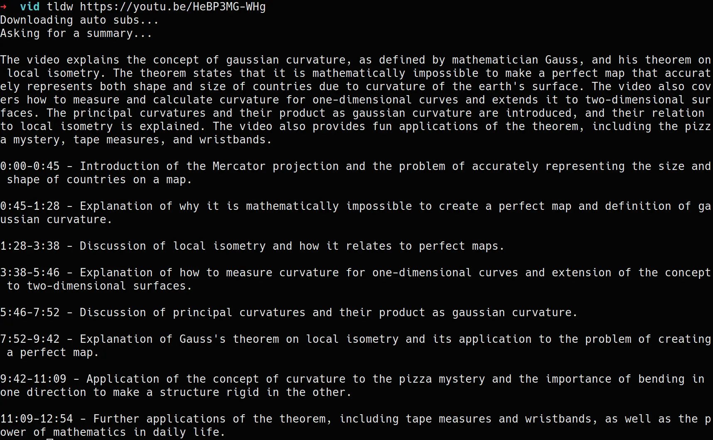

# tl;dw

Generate summaries for youtube videos with timestamps for relevant chapters.

## Demo



## Install

```
sudo pacman -S yt-dlp
cargo install --git https://github.com/ambiso/tldw.git
```

## Usage

You need to have `yt-dlp` installed and an `api_key.txt` in the current directory, that contains your OpenAI API key. Get an API key from [here](https://platform.openai.com/account/api-keys).

```
tldw <YOUTUBE URL>
```

